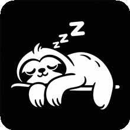
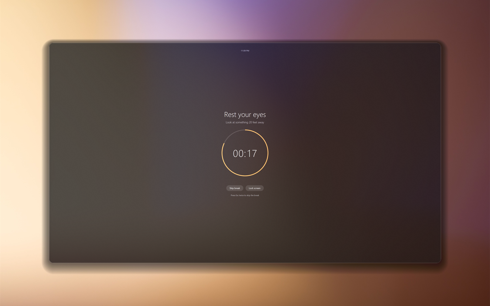
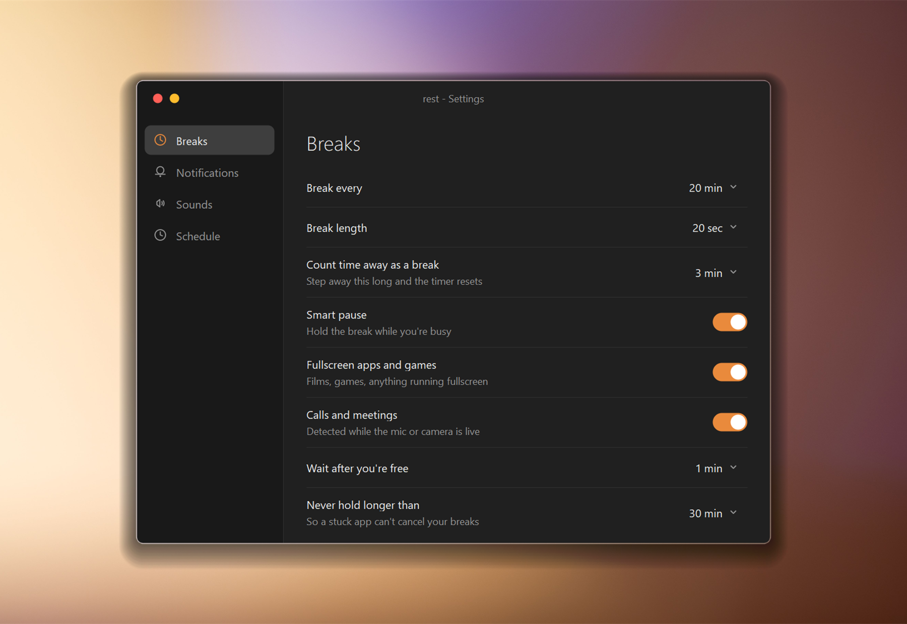
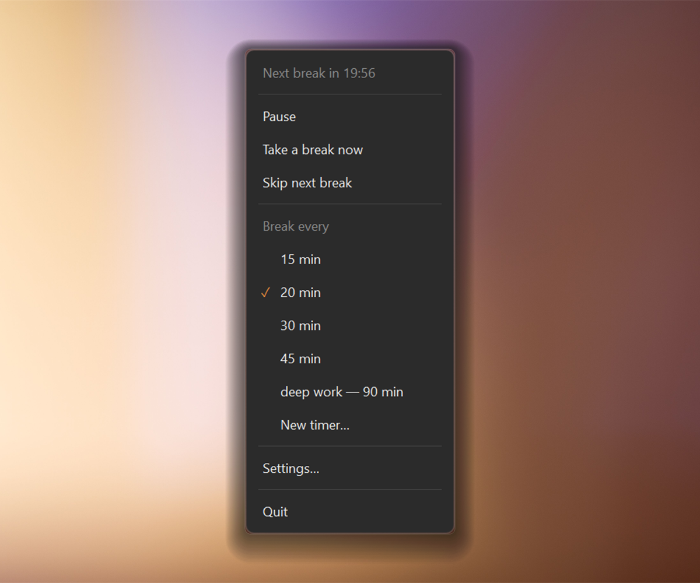

<p align="center">
  
</p>

<h1 align="center">rest</h1>

<p align="center">eye breaks for windows that stay out of your way</p>

<p align="center">
  
  
  
  
</p>

<p align="center">
  
</p>

## what it does

rest lives in your tray and reminds you to look away from the screen every twenty
minutes, which is the 20-20-20 rule. hours of staring at a monitor dries your eyes
and tires the muscles that hold focus, and the cure is boring: look at something far
away for twenty seconds. the hard part is remembering.

most reminder apps solve the remembering by interrupting you at the worst possible
moment. rest tries not to. it notices when you are on a call, playing something
fullscreen, or presenting, and holds the break until you are free again. if you walk
away from the keyboard it counts that as a real break and quietly resets. a stuck
app can never cancel your breaks forever, there is a ceiling on how long a break can
be held.

when a break does arrive you choose how loud it is. a fullscreen overlay that blurs
the desktop on every monitor, a small notification in the corner you pick, a centred
popup, or a card that follows your cursor. sounds are generated in code so nothing
ships as an audio file, and you can point it at your own wav instead.

it is one executable, raw win32, no runtime to install, no installer, no telemetry,
no background service. idle memory sits around 11 mb and a break costs about a
tenth of a percent of one core.

<p align="center">
  
</p>

<p align="center">
  
</p>

## install

grab `rest.exe` from the releases page, put it wherever you keep small tools, and run
it. nothing is written outside your user profile. the sloth appears in your tray and
that is the whole interface.

turn on launch at login from settings if you want it back after a reboot. your
settings live in `%appdata%\rest\settings.json` and you can edit that file by hand if
you prefer.

## build

you need the visual studio build tools with the windows sdk, and cmake 3.20 or newer.
there is nothing to fetch, no package manager, no vcpkg.

```
cmake -B build
cmake --build build --config Release
```

the binary lands at `build\src\Release\rest.exe`.

## credits

the backdrop in the screenshots is by juan pablo serrano arenas on pexels. the sloth
is the app icon and it sleeps a lot, which is the point.
